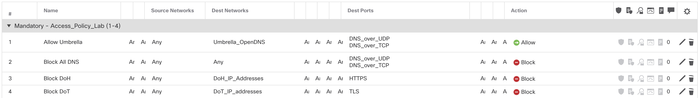

# Block known DNS-over-HTTPS (DoH) servers with Cisco Firepower Threat Defense

## Keep your users secure and avoid bypassing of your security controls

DNS-over-HTTPS (DoH) is a standard for performing DNS resolution via via the HTTPS protocol. Instead of performing plain text (n.a. for Umbrella) DNS requests on port 53, a client to a DoH-compatible DNS server using an encrypted HTTPS connection instead of a plain text (n.a. for Umbrella) one.

**Risks, why would you NOT use it:**
* Some individuals and organizations rely on DNS (e.g. Umbrella) to block malware, enable parental controls, or filter your browser’s access to websites;
* Mozilla Firefox uses Cloudlfare as default DoH provider. This gives Cloudflare full visibility into the DNS requests of the client;
* DoH could be [slower](https://support.mozilla.org/en-US/kb/firefox-dns-over-https) than traditional DNS queries.

**Business outcomes:**
* The result will be that DoH is blocked;
* This causes browsers to revert back to “regular” DNS;
* Cisco Umbrella is then again able to to block malware, enable parental controls, or filter your browser’s access to websites .

## White Paper
The NSA also recommends to take a similar approach and blocking DoH. Read more [here](https://www.nsa.gov/Press-Room/News-Highlights/Article/Article/2471956/nsa-recommends-how-enterprises-can-securely-adopt-encrypted-dns/).
## How to use:**

Pulls DoH domains and resolves them to IP addresses (from: https://github.com/curl/curl/wiki/DNS-over-HTTPS). Then it creates a Network Group Object in Firepower to be blocked (or something else). This can be used to block DoH and enforce Umbrella. More information an that can be found on the following link: https://support.umbrella.com/hc/en-us/articles/230904088-Preventing-Circumvention-of-Cisco-Umbrella-with-Firewall-Rules

**Installation**

These instructions will enable you to download the script and run it, so that the output can be used in Firepower as Group Objects. What do you need to get started? Please find a list of tasks below:

1. You need the IP address (or domain name) of the FMC, the username and password. It is recommended to create a separate FMC login account for API usage, otherwise the admin will be logged out during every API calls. Add the IP/Domain of FMC, the username and password to the `config.json` file. 

2. In the FMC, go to `System > Configuration > REST API Preferences` to make sure that the REST API is enabled on the FMC.

3. A Network Group object will be created automatically during the first run of the script.

4. It is also recommended to download an SSL certificate from FMC and put it in the same folder as the scripts. This will be used to securely connect to FMC. In the `config_file.json` file, set the `SSL_VERIFY` parameter to `true`, and then set `SSL_CERT` to be the path to the FMC's certificate.

5. If you do not have the needed Python libraries set up, you will get an error when executing the script. You will need to install the `requirements.txt` file like this (make sure you are in the same directory as the cloned files live):

```
pip install -r requirements.txt
```

6. After this is complete you need to execute the script (make sure you are in the same directory as the cloned files live):

```
python3.6 doh_ip_resolving.py
```

7. Optionally you can let this script run periodically, by setting `SERVICE` to `true` in the `config_file.json` file. In line 244 of the `doh_ip_resolving.py` the time-period is set, per default it is set to an hour (Microsoft recommends you check the version daily, or at the most, hourly):

```
intervalScheduler(WebServiceParser, 3600) #set to 1 hour
```

8. Finally, if you want to automatically deploy the policies, you can set `AUTO_DEPLOY` to *true* in the `config_file.json` file. **Be very careful with this, as unfinished policies might be deployed by doing so.**

This can be an example of a policy in FMC:


